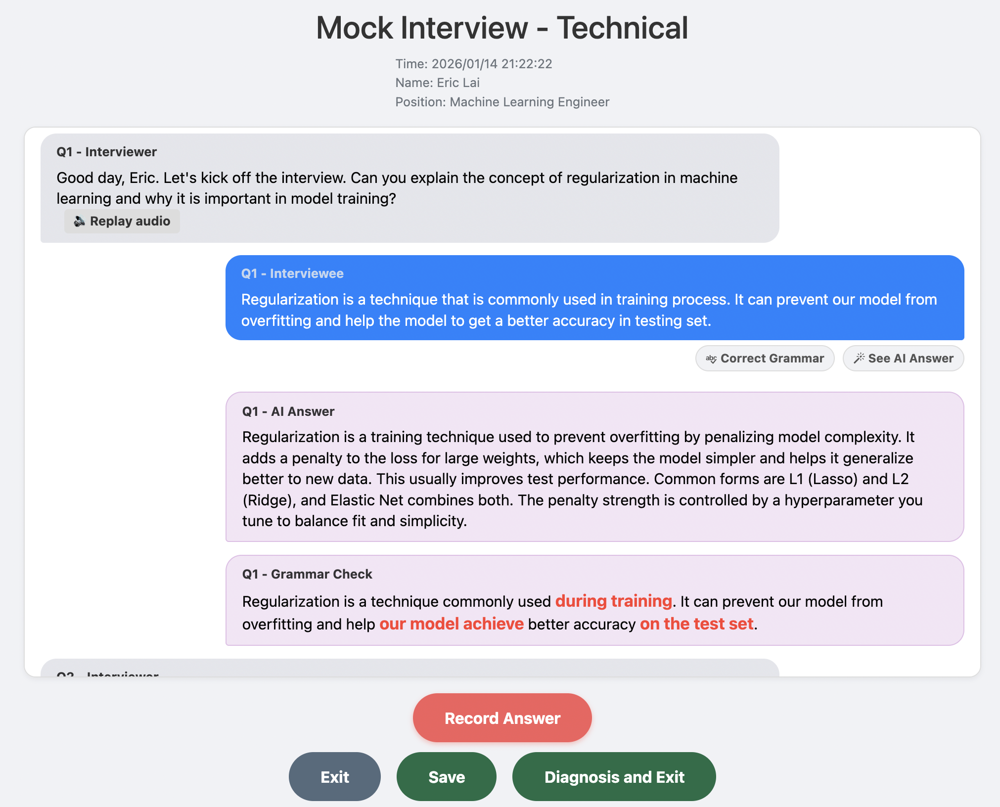

# AI Mock Interview

[English](./README.md) | [繁體中文](./README.zh-TW.md)

Use AI to do mock interviews while AI is taking away our jobs 👊😡.

(Only tested on macOS using Chrome as the browser.)

## Features:
* A chatbot-style web interface where you can record your voice and receive spoken feedback from an LLM.
* Upload your Resume (pdf) and set your interview preferences.
* Get grammar corrections or AI-suggested answers during the interview.
* Receive an interview diagnosis from the LLM.





## Prerequisites
* 💰 OpenAI API key: cheaper than you think.
* 🐳 Docker (you can also run in Python environment without Docker).

## Getting Started
### 1. Prepare the Docker Image:
You can either pull the image direcly, or build from scratch.

#### Pull directly:
```
docker pull ghcr.io/hyades910739/ai-mock-interview:latest
```
#### Build from scratch:
first, clone this repo.
```
git clone https://github.com/hyades910739/ai-mock-interview.git
```
Then docker build
```
docker build --no-cache -t ai-mock-interview .
```
### 2. Run Docker Image:
```
docker run -p 8000:8000 -e OPENAI_API_KEY="sk-***" ai-mock-interview
```
* Note that you can either set `OPENAI_API_KEY` in `docker run` or configure it later on the settings page.
* Grant microphone permission in your browser.

